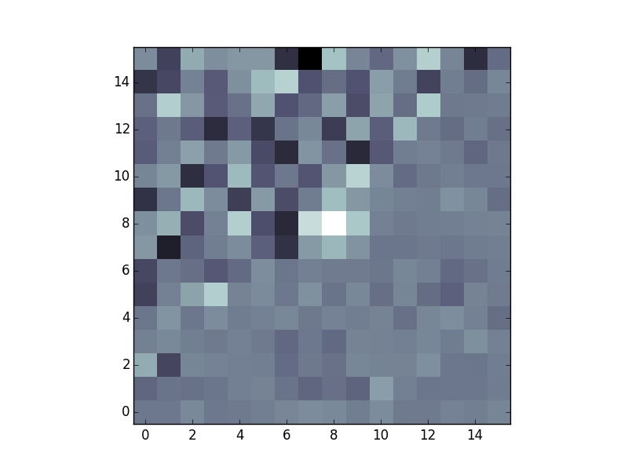

Source detection
================

Once the data has been background subtracted, detect objects in the 
data, given some threshold::

   thresh = 1.5 * bkg.globalrms
   objects = sep.extract(data, thresh)

   # objects is a numpy structured array:
   len(objects)  # number of objects
   objects['x'][i]  # flux-weighted x-center coordinate of i-th object
   ...              # ... and many other fields.

See the reference section for all the fields available in the returned
structured array.

.. warning::

   Be careful! If the data array is not background-subtracted or the
   threshold is too low, you will tend to get one giant object or,
   more likely, an exception will be raised due to exceeding the
   internal memory constraints of the function.

Using a matched filter (convolution)
------------------------------------

For source detection, SEP supports using a matched filter, which can
give the optimal detection signal-to-noise for objects with some known
shape. This is controlled using the ``conv`` keyword in
`sep.extract`. For example::

    conv_kernel = np.array([[1., 2., 3., 2., 1.],
                            [2., 3., 5., 3., 2.],
                            [3., 5., 8., 5., 3.],
                            [2., 3., 5., 3., 2.],
                            [1., 2., 3., 2., 1.]])
    objects = sep.extract(data, thresh, conv=conv_kernel)

By default (if ``conv`` is not specified) a default 3 by 3 kernel is used. To
disable filtering entirely, specify ``conv=None``. 

What array should be used for ``conv``? It should be approximately the
shape of the objects you are trying to detect. For example, to
optimize for the detection of point sources, ``conv`` should be set to
shape of the point spread function (PSF) in the data. For galaxy
detection, a larger kernel could be used. In practice, anything that
is roughly the shape of the desired object works well since the main
goal is to negate the effects of background noise, and a reasonable
estimate is good enough.

For object
detection, we assume that for each output pixel the data consists of a single
point source at the location of that output pixel. We then apply the matched
filter algorithm for each output pixel individually. For the full derivation of the matched filter formula, see the last section in this page.

**Correct treatment in the presence of variable noise**

In Source Extractor, the matched filter is implemented assuming there
is equal noise across all pixels in the convolution kernel. The
matched filter then simplifies to a convolution of the data with the
PSF. In `sep.extract`, this is also the default behavior.

However, SEP also supports a full matched filter implementation with
correctly treated independent errors on each of the input pixels. Some
benefits of this method are that flagged bad pixels are ignored,
detector sensitivity can be taken into account, and edge effects are
handled gracefully. For example, suppose we have an image with noise
that is higher in one region than another::

    n = 16
    X, Y = np.meshgrid(np.arange(n), np.arange(n))
    mask = Y > X
    error = np.ones((n, n))
    error[mask] = 4.0
    data = error * np.random.normal(size=(n, n))

    # add source to middle of data
    source = 3.0 * np.array([[1., 2., 1.],
                             [2., 4., 2.],
                             [1., 2., 1.]])
    m = n // 2 - 1
    data[m:m+3, m:m+3] += source

    plt.imshow(data, interpolation='nearest', origin='lower', cmap='bone')

The default behavior of SEP matches that of Source Extractor, and it will
not detect the object:

    >>> objects = sep.extract(data, 3.0, err=error)
    >>> len(objects)
    0

Setting ``use_matched_filter=True`` correctly deweights the noisier pixels
around the source and detects the object:

    >>> objects = sep.extract(data, 3.0, err=error, use_matched_filter=True)
    >>> len(objects)
    1

Derivation of the matched filter formula
----------------------------------------

Assume that we have an image containing a single point source. This produces a
signal with PSF :math:`S_i` and noise :math:`N_i` at each pixel indexed by
:math:`i`. Then the measured image data :math:`D_i` (i.e. our pixel values) is
given by:

.. math::
    D_i = S_i + N_i

Then we want to apply a linear transformation :math:`T_i` which gives an
output :math:`Y`:

.. math::
    Y = \sum_i T_i D_i = T^T D

We use matrix notation from here on and drop the explicit sums. Our objective
is to find the transformation :math:`T_i` which maximizes the signal-to-noise
ratio :math:`SNR`.

.. math::
    SNR^2 = \frac{(T^T S)^2}{E[(T^T N)^2]}

We can expand the denominator as:

.. math::
    E[(T^T N)^2] &= E[(T^T N)(N^T T)] = T^T \cdot E[N N^T] \cdot T = T^T C T

Where :math:`C_{ik}` is the covariance of the noise between pixels :math:`i`
and :math:`k`. Now using the Cauchy-Schwarz inequality on the numerator:

.. math::
    (T^T S)^2 = (T^T C^{1/2} C^{-1/2} S)^2 \le (T^T C^{1/2})^2 (C^{-1/2} S)^2 =
    (T^T C T) (S^T C^{-1} S)

since :math:`C^T = C`. The signal-to-noise ratio is therefore bounded by:

.. math::
    &SNR^2 \le \frac{(T^T C T)(S^T C^{-1} S)}{(T^T C T)} \\
    &SNR^2 \le S^T C^{-1} S

Choosing :math:`T = \alpha C^{-1} S` where :math:`\alpha` is an arbitrary
normalization constant, we get equality. Hence this choise of :math:`T` is the
optimal linear tranformation. We normalize this linear transformation so that
if there is no signal and only noise, we get an expected signal-to-noise ratio
of 1. With this definition, the output :math:`SNR` represents the number of
standard deviations above the background. This gives:

.. math::
    &E[(T^T N)^2] = T^T C T = \alpha^2 S^T C^{-1} C C^{-1} S = \alpha^2 S^T
    C^{-1} S = 1 \\ 
    &\alpha = \frac{1}{\sqrt{S^T C^{-1} S}}

Putting everything together, our normalized linear transformation is:

.. math::
    T = \frac{C^{-1} S}{\sqrt{S^T C^{-1} S}}

And the optimal signal-to-noise is given in terms of the known variables as:

.. math::
    SNR = \frac{S^T C^{-1} D}{\sqrt{S^T C^{-1} S}}
